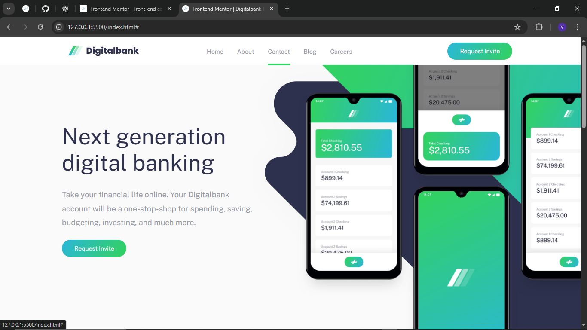
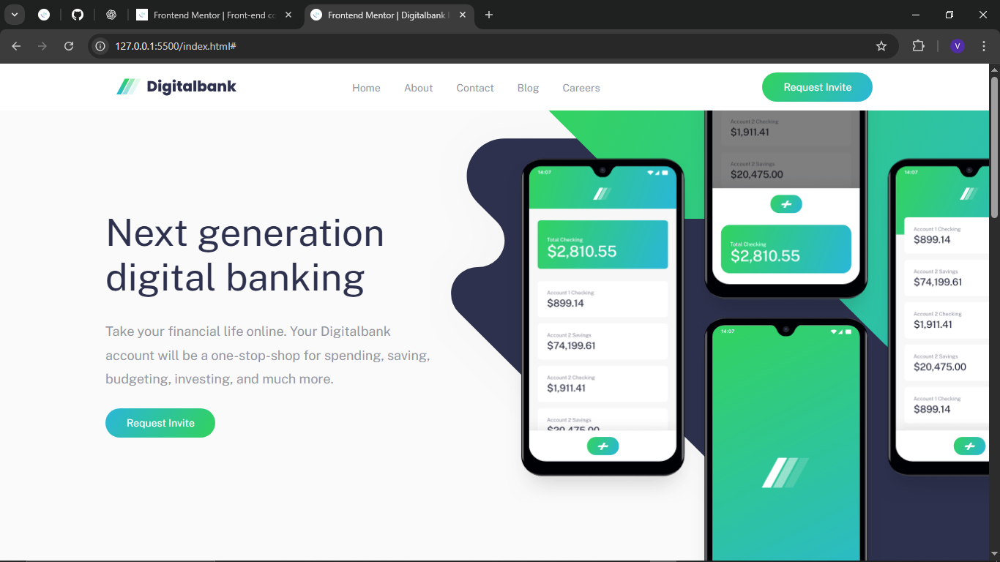
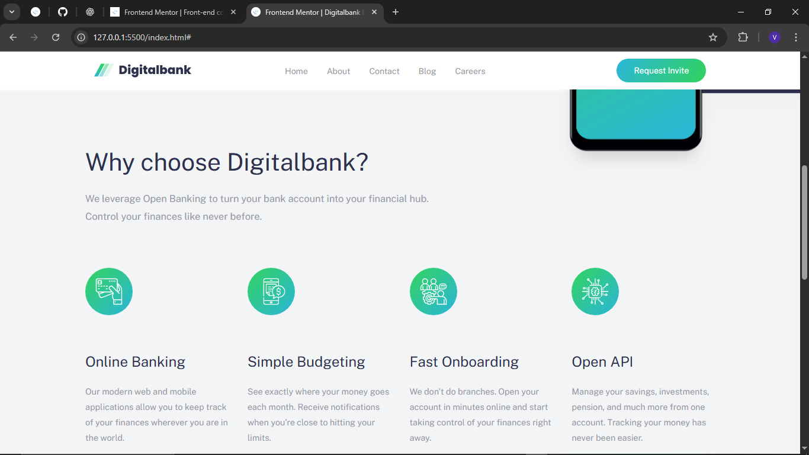
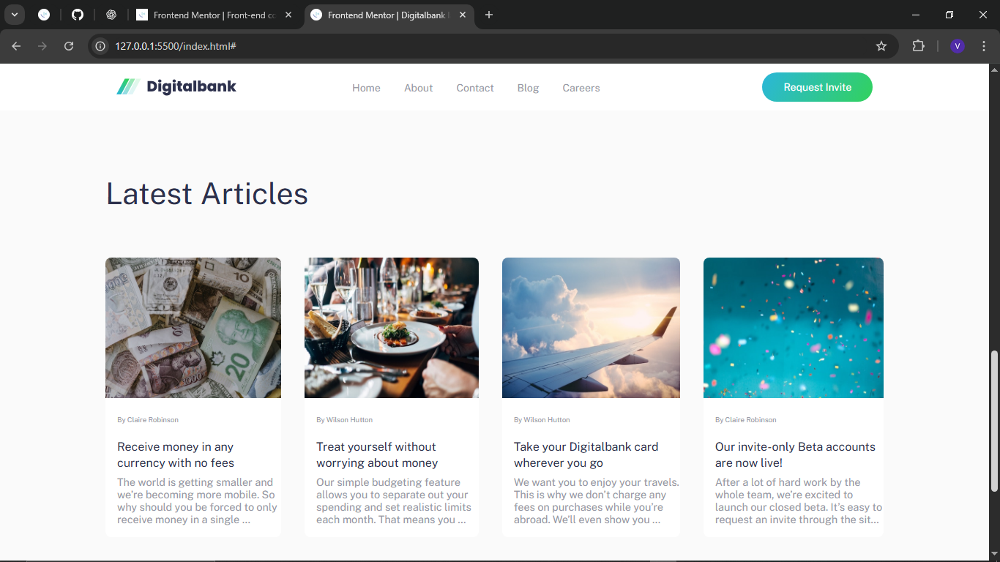
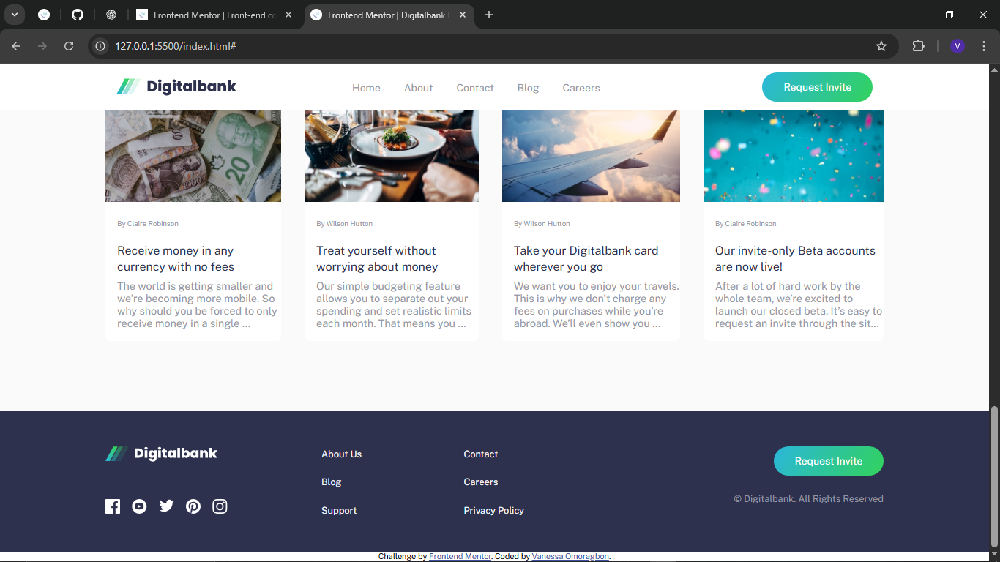

# Frontend Mentor - Digitalbank landing page solution

This is my solution to the [Digitalbank landing page challenge on Frontend Mentor](https://www.frontendmentor.io/challenges/digital-bank-landing-page-WaUhkoDN). Frontend Mentor challenges help me improve my coding skills by building realistic projects.

## Table of contents

- [Overview](#overview)
  - [The challenge](#the-challenge)
  - [Screenshot](#screenshot)
  - [Links](#links)
- [My process](#my-process)
  - [Built with](#built-with)
  - [What I learned](#what-i-learned)
  - [Continued development](#continued-development)
  - [Useful resources](#useful-resources)
- [Author](#author)
- [Acknowledgments](#acknowledgments)

## Overview

### The challenge

I wanted users to be able to:

- View the optimal layout for the site depending on their device's screen size
- See hover states for all interactive elements on the page

### Screenshot

### Links

- Solution URL: (https://www.frontendmentor.io/solutions/responsive-digitalbank-landing-page-built-with-html-css-javascript-2CpdOj9v_Z)
- Live Site URL: https://vanessadesuwa.github.io/digitalbank-landing-page-master/

## My process

### Built with

- Semantic HTML5 markup
- CSS custom properties
- Flexbox
- Mobile-first workflow

### What I learned

#### My progress and solutions

- **HTML structure:** I used semantic tags like `<header>`, `<main>`, `<section>`, and `<footer>`. My navigation is split into desktop and mobile menus for responsiveness. I added an overlay `
` for mobile menu effects.

- **CSS layout:** I built a responsive layout using Flexbox and custom properties for colors and spacing. My media queries adjust padding, widths, and flex direction for different screen sizes. I cleaned up and optimized all media queries for a consistent mobile and desktop experience.

- **Button gradient:** I implemented gradient backgrounds for my buttons using `background: linear-gradient(120deg, hsl(192, 70%, 51%), hsl(136, 64%, 51%));`.

- **Flexbox challenges:** I fixed shifting and stacking issues by setting proper widths and flex-basis for `.feature` and `.features-list`. I made sure my `.hero` children are side by side with `display: flex; flex-direction: row;` and percentage widths.

- **Mockup image overlap:** I achieved overlap of the mockup image onto the `.features` section using negative margin and `z-index`.

- **Mobile menu:** I made the mobile menu background visible and centered by adjusting background color, max-width, and margin. I used media queries to toggle visibility and layout.

- **Overlay effect:** I added an `.overlay` div to dim the rest of the content when the mobile menu is open. I toggle its `.active` class with JavaScript for a smooth user experience.

- **Preventing scroll:** I disabled page scroll when the mobile menu is open by toggling a `.no-scroll` class on `<body>` and setting `overflow: hidden;` in CSS.

- **Spacing issues:** I fixed weird left space at certain breakpoints by reviewing and cleaning up media queries, making sure my containers use `width: 100%`, `margin: 0 auto`, and equal left/right padding.

- **Questions I asked and solved:**
  - How do I make a button gradient in CSS?
  - How do I fix flexbox element shifting?
  - How do I keep `.hero` children side by side?
  - How do I crop and position images for overlap?
  - How do I center and style the mobile menu?
  - How do I add an overlay and prevent scroll when the menu is open?
  - How do I fix layout and spacing issues at different breakpoints?

### Continued development

- I want to improve accessibility (keyboard navigation, ARIA labels)
- I plan to add animations for menu transitions
- I will refactor my CSS for better maintainability

### Useful resources

- [MDN Web Docs](https://developer.mozilla.org/) - My go-to reference for HTML, CSS, and JavaScript.
- [CSS Tricks](https://css-tricks.com/) - Helped me with Flexbox and responsive design tips.
- [Frontend Mentor Community](https://www.frontendmentor.io/community) - I asked questions and got feedback here.

## Author

- My name is Vanessa Omoragbon
- Frontend Mentor - [@vanessadesuwa](https://www.frontendmentor.io/profile/vanessadesuwa)

## Acknowledgments

Thanks to Frontend Mentor and the community for feedback and support. Special thanks to GitHub Copilot for helping me solve tricky layout and CSS issues as I built this project.
